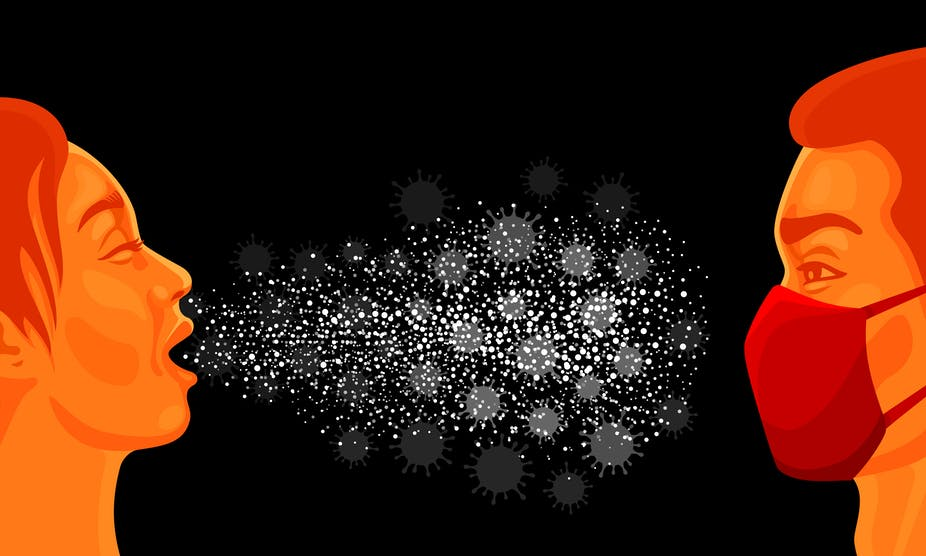

# Virus Transmission

Virus spread can not only cause serious health issues, but also overload health systems.

In this project we will take a look at a virus transmission in a population.

Our goal is to search for insights that can help us to take better actions to prevent the fast spread of the virus.

## Development

The development of this project is divided into the following notebooks:

- [Exploratory Data Analysis](source/1_eda.ipynb)
- [Preprocessing](source/2_preprocess.ipynb)
- [Transmission Rate Estimation](source/3_modeling.ipynb)
- [Simulations](source/4_simulations.ipynb)

## Results

In this project we first took a look at the data to understand what we are dealing with and what kind of preprocess would have to be done.  

With the correct dataset, we selected the Multi-Layer Perceptron algorithm as the model to estimate the virus transmission rate between two people. It achieved a maximum transmission rate error of +-10% for most of the dataset.

It was now possible to complete the missing transmission rate for the whole population.  
Not only that, we could also interpret the model to understand that proximity, tranportation method and sports are the most important features to estimate the transmission rate.

Finally, experiments using the population connections were ran to evaluate the contamination curve and the following actions were simulated to understand its impacts:

- limit proximity: it's a lockdown, where only people who live together can connect with each other
- use mask: is a simple way to reduce transmission rate without changing any characteristic or connection
- stop playing sports: is an effort to change people characteristic to not play sports in orther to reduce transmission rate
- stop using public transportation: without public transportation, people have to take your own transportation to reduce transmisison rate
